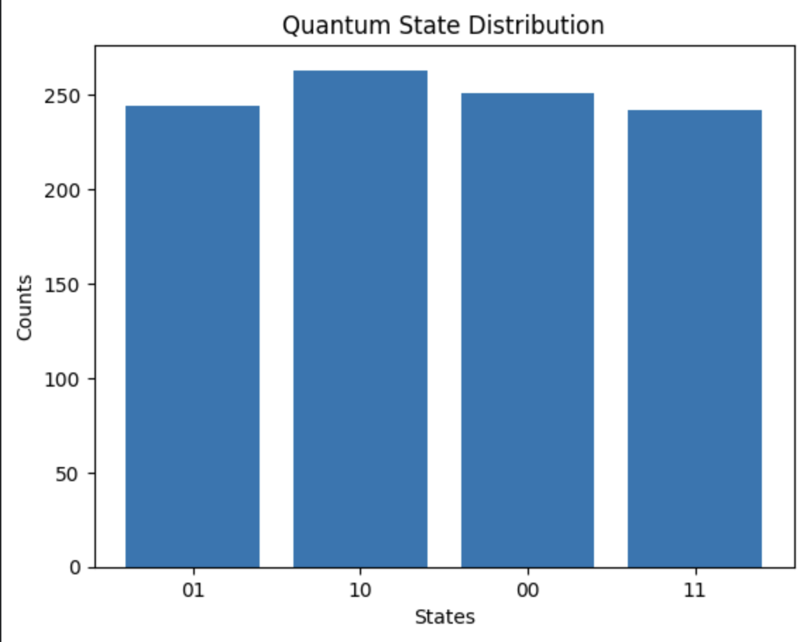

# Quantum State Visualizer

This project visualizes quantum state probabilities using a bar graph.

---

## 🧠 Concept

Quantum systems exist in superposition. When measured, they collapse into classical states with certain probabilities.

---

## ⚙️ How it works

- Initialize 2 qubits in state |0⟩  
- Apply Hadamard (H) gates → creates superposition  
- Measure qubits → get probabilistic outputs  
- Plot results using a bar graph  

---

## 📊 Output

The graph below shows the probability distribution of quantum states:



---

## 💻 Code

```python
from qiskit import QuantumCircuit
from qiskit_aer import Aer
from qiskit import transpile
import matplotlib.pyplot as plt

qc = QuantumCircuit(2, 2)

qc.h(0)
qc.h(1)

qc.measure([0,1], [0,1])

sim = Aer.get_backend('aer_simulator')

compiled_circuit = transpile(qc, sim)
result = sim.run(compiled_circuit, shots=1000).result()

counts = result.get_counts()

plt.bar(counts.keys(), counts.values())
plt.xlabel("States")
plt.ylabel("Counts")
plt.title("Quantum State Distribution")

plt.show()
